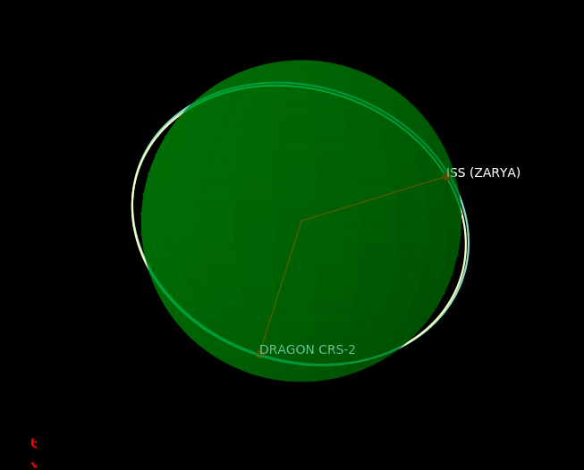
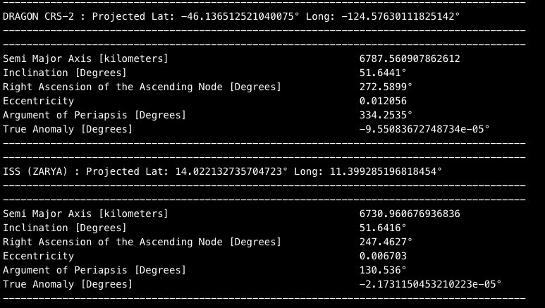

# SpaceMan

SpaceMan is a python package that accomplishes several unique tasks within the space of Astrodynamics. The package gives users the ability to parse satellite Two-Line Element (TLE) Data into its Ballistic, Keplerian, and Satellite Identifying orbital elements. Beyond, this SpaceMan uses a `Matplotlib` 3D plotting toolkit to plot the orbit of the satellites.

# Basic Usage

`python3
from spaceman.Draw import Draw
from spaceman.Orbit import Orbit, satellites

#Create Class instances
o = Orbit()
d = Draw()

#Call the draw Orbit function
d.draw_orbit(satellites.ISS, satellites.Dragon)
`
Using the code above will output an image that resembles this:

Along with this, by calling the `draw_orbit()` you will print out the keplerian elements used to calculate the satellites trajectory.

I know that I struggled to find resources explaining the mathematics used within Astrodynamics and orbital mechanics, so I have included the "OrbitalMechanicsCalculations.txt" file that explains the mathematics behind several of the more complex functions and the logic behind them. 
